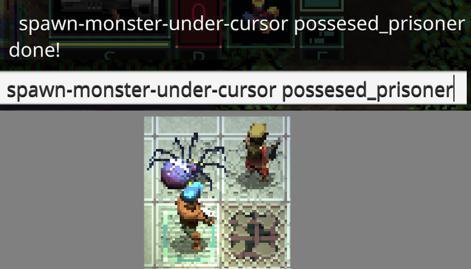

# Quasimorph Spawn Monster Console Command

Adds the dev console command spawn-monster-under-cursor.

# Usage
In combat (the dungeon), move the cursor to the location which the monster will spawn.
Open the console and type: spawn-monster-under-cursor and then the id of the monster to spawn.

Example: `spawn-monster-under-cursor possesed_man_worker`

The unit will be spawned under the cursor.

# Creature Id list.

The list of creatures can be found at `%AppData%\..\LocalLow\Magnum Scriptum Ltd\QM_SpawnMonsterCommand\Creatures.txt`
This list will be created after the mod has been installed and the game run once.

## Auto Complete

The command also supports auto complete. Type `spawn-monster-under-cursor ` (with a space) and type a partial name.  For example, 'man'.
Press tab and the list of monsters that include man will be listed.  Press up and down arrows to use an entry.

To list all of the creatures, use `_` as the Id.

# Support
If you enjoy my mods and want to buy me a coffee, check out my [Ko-Fi](https://ko-fi.com/nbkredspy71915) page.
Thanks!

# Source Code
Source code is available on GitHub at https://github.com/NBKRedSpy/QM_SpawnMonsterCommand

# Change Log

## Version 1.1.0
* Version .8 compatibility.
